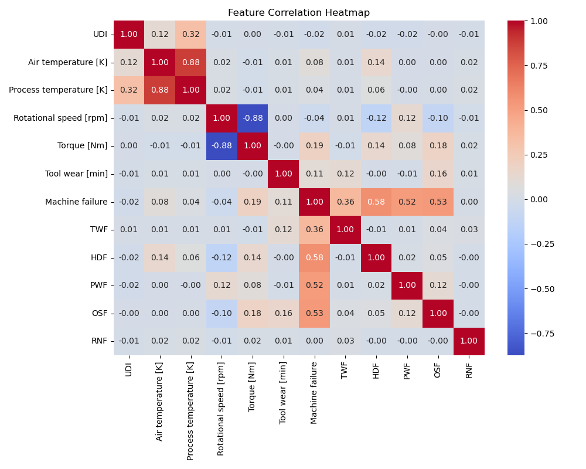
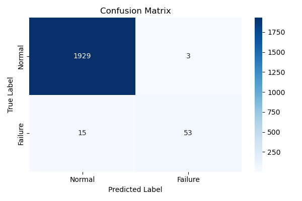
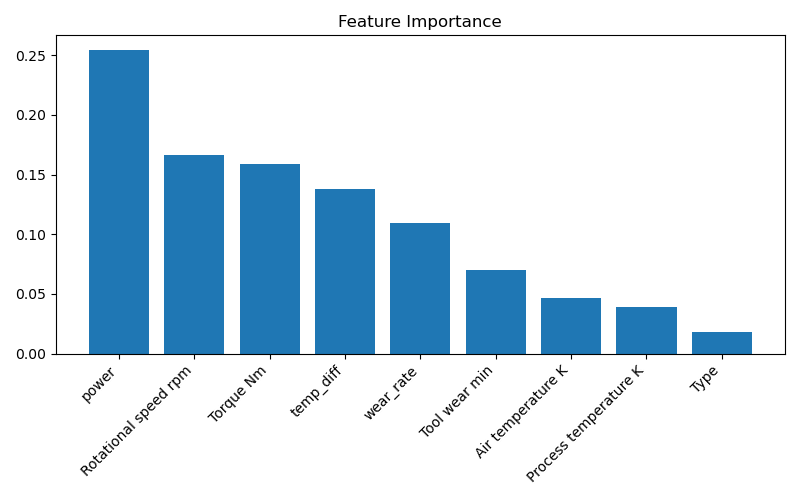
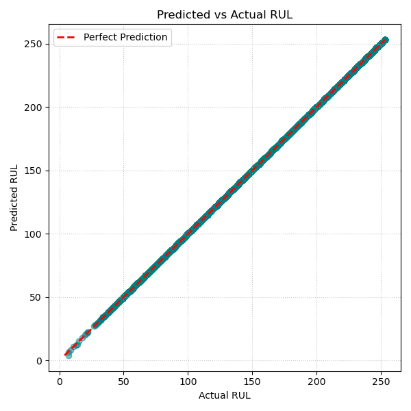

# Smart Predictive Maintenance System

### Try out live!
[https://tanishapritha-predictive-maintenance-ml-app-caonzt.streamlit.app/](https://tanishapritha-predictive-maintenance-ml-app-caonzt.streamlit.app/)

## Overview
This project implements a production-quality predictive maintenance system using the UCI AI4I 2020 dataset. It features a complete end-to-end machine learning pipeline that includes binary classification for machine failure prediction and a regression model to estimate Remaining Useful Life (RUL), culminating in a real-time Streamlit dashboard for monitoring machine health.

## Dataset
The dataset utilized is the **UCI AI4I 2020 Predictive Maintenance Dataset**. It represents realistic, tabular sensor data reflecting standard industrial parameters.

### Column Definitions
| Feature | Type | Description |
|---|---|---|
| Type | Categorical | Machine quality type (L: Low, M: Medium, H: High) |
| Air temperature [K] | Numeric | Ambient air temperature in Kelvin |
| Process temperature [K] | Numeric | Process temperature in Kelvin |
| Rotational speed [rpm] | Numeric | Speed of rotation in revolutions per minute |
| Torque [Nm] | Numeric | Torque applied in Newton-meters |
| Tool wear [min] | Numeric | Cumulative tool wear time in minutes |
| Machine failure | Binary | Target label indicating failure (1) or normal operation (0) |

*(Note: Identifying columns like UDI, Product ID, and individual failure modes like TWF, HDF, PWF, OSF, and RNF are dropped during preprocessing to maintain robust feature learning.)*

## Pipeline
The machine learning pipeline is modularized into the following stages:

1. **EDA & Data Understanding:** Explores feature distributions, targets, and correlations (refer to notebooks).
2. **Feature Engineering (`src/preprocess.py`):** 
   - Generates industrial-specific indicators such as `temp_diff`, `power`, and `wear_rate`.
3. **Model Training (`src/model.py`, `src/rul_model.py`):**
   - Evaluates Logistic Regression, Random Forest, and XGBoost classifiers for robust failure detection.
   - Trains a Random Forest Regressor to approximate Remaining Useful Life.
4. **Interactive Dashboard (`app.py`):** Provides a Streamlit frontend for dynamic, user-driven inference.

## Key Results
*(Below are sample results from the validation set)*

| Model Task | Metric | Value |
|---|---|---|
| Classification (Best Model) | Accuracy | ~0.98 |
| Classification (Best Model) | F1 Score | ~0.85 |
| Regression (RUL Model) | MAE | 0.00389 |
| Regression (RUL Model) | RMSE | 0.07780 |

## Setup and Run Instructions

### 1. Installation
Clone the repository, create a virtual environment, and install dependencies:
```bash
# Install required packages
pip install -r requirements.txt
```

### 2. Prepare Data and Train Models
Run the training script to build models and the data scaler:
```bash
python -c "from src.data_loader import load_data; from src.preprocess import preprocess_and_scale, save_processed_data; from src.model import train_and_evaluate_classifiers; from src.rul_model import train_and_evaluate_rul_model; df = load_data('data/ai4i2020.csv'); df_proc, _ = preprocess_and_scale(df); save_processed_data(df_proc); train_and_evaluate_classifiers(df_proc); train_and_evaluate_rul_model(df_proc);"
```

### 3. Run the Dashboard
Launch the interactive Streamlit app:
```bash
streamlit run app.py
```

## Project Visualizations

### Feature Correlation Heatmap


### Model Confusion Matrix


### Random Forest Feature Importance


### RUL Predictions (Predicted vs Actual)

